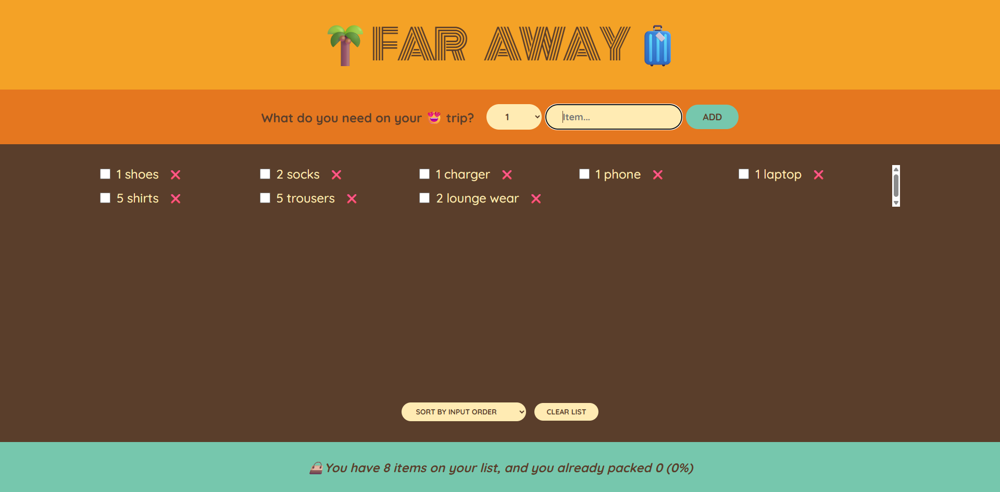

# 🌍 Travel List App (React)

A simple and interactive **Travel Packing List Application** built using React.
This app helps users organize, manage, and track items they need to pack for their trips.

---

## 📌 Overview

The Travel List App is designed to demonstrate core React concepts such as:

- Component-based architecture
- State management using Hooks
- Lifting state up
- Controlled components
- Dynamic rendering

It provides a clean and intuitive interface to add, delete, and manage travel items efficiently.

---

## ✨ Features

- ➕ Add items to your travel list
- ❌ Remove items from the list
- ✔️ Mark items as packed/unpacked
- 🔢 Track total and packed items
- 🔄 Sort items (e.g., input order, packed status)
- 🧹 Clear entire list

---

## 🛠️ Tech Stack

- **Frontend:** React (Functional Components + Hooks)
- **Styling:** CSS
- **State Management:** useState (with lifted state pattern)

---

## 🧠 Key Concepts Demonstrated

This project focuses on important React fundamentals:

- 🔹 **Lifting State Up** – Sharing state between sibling components
- 🔹 **Controlled Inputs** – Managing form inputs via React state
- 🔹 **Props & Data Flow** – Parent → Child communication
- 🔹 **Derived State** – Calculating stats like packed percentage

---

## 📂 Project Structure

```
src/
│── components/
│   ├── App.js
│   ├── Form.js
│   ├── PackingList.js
│   ├── Item.js
│   └── Stats.js
│
└── index.js
```

---

## ⚙️ Installation & Setup

1. Clone the repository:

```bash
git clone https://github.com/SuryaTejaTangella/Travel-List-App-React.git
```

2. Navigate to project directory:

```bash
cd Travel-List-App-React
```

3. Install dependencies:

```bash
npm install
```

4. Run the app:

```bash
npm start
```

5. Open in browser:

```
http://localhost:3000
```

---

## 📸 Screenshots



---

## 🚀 Future Enhancements

- 💾 Local storage persistence
- 🌙 Dark mode support
- 📱 Mobile responsiveness improvements
- 🔍 Search & filter functionality
- ☁️ Backend integration

---

## 🤝 Contributing

Contributions are welcome!
Feel free to fork the repo and submit a pull request.

---

## 📄 License

This project is open-source and available under the MIT License.

---

## 👨‍💻 Author

**Suryateja Tangella**

- Aspiring Software Developer | React & Java Backend Enthusiast
- Transitioning from Banking → IT / FinTech

---

## ⭐ Show Your Support

If you like this project, give it a ⭐ on GitHub!
